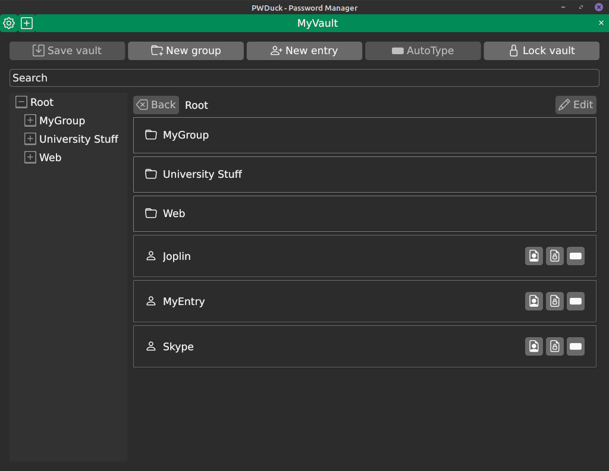
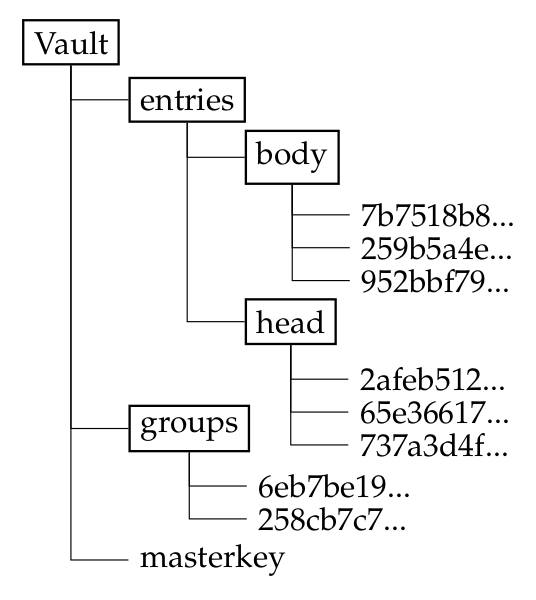
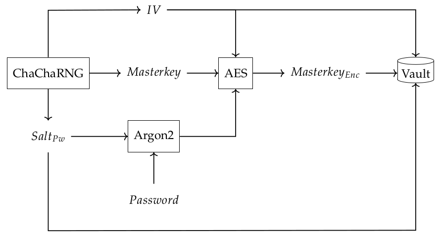
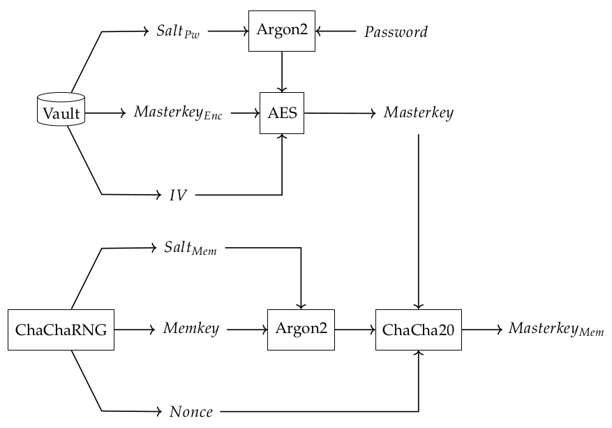
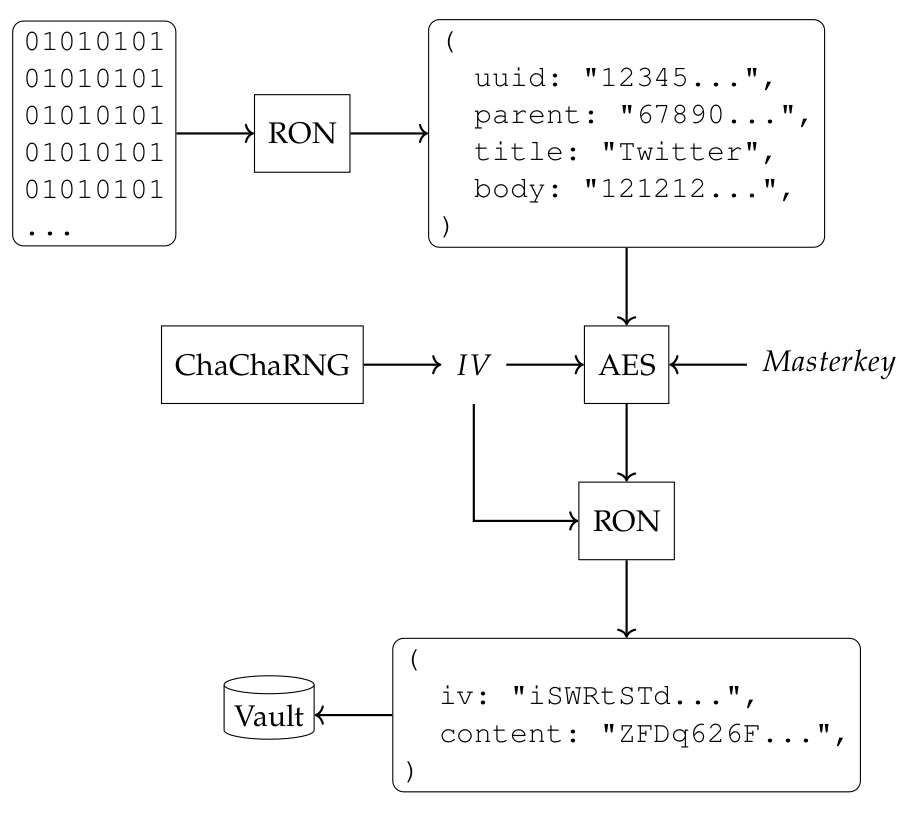

# PWDuck 🦆

A little duck 🦆 protecting your passwords. The passwords are stored in a folder, acting as a _Vault_, locally on your filesystem. The vault contains multiple files. Each file represents one passwords. With this file based storing, the passwords can be easily synchronized between multiple devices using a synchronization of your choice.

> :warning: This application was developed by an amateur (me). There is no guarantee that your passwords are safe and secure and there was never done an audit from a third party! Don't use this with real data and use this on your own risk!

## Cryptography

### The layout of a Vault

The following image show the layout of a vault. It contains two directories _entries_ and _groups_ along with a _masterkey_. The master-key is encrypted using the master-password of the user.

An entry represents the collection of a username and a password along with other useful information. They are further distributed into a _head_ and a _body_. The entry head contains non-critical information like the name and an unique identifier of the entry, where the entry body contains all critical information like the password. This distribution allows to load all entries into the application to display them to the user without the need to decrypt the password. The critical information will only be decrypted when it is actually needed by the application.

Entries can be organized in groups. A group can also contain subgroups. The encrypted file of a group currently only contains the name of the group along with it's unique identifier. An encrypted group doesn't know it's children. The children itself knows to which group it belongs to. This strategy prevents synchronization conflicts when adding new entries on two different computers.

The filename of a group or an entry is derived from the unique identifier using `sha256`. This prevents leaking information about the content of the file.

### Creation and encryption of the master-key

For generating random data the [ChaCha](https://rust-random.github.io/rand/rand_chacha/) algorithm is used as a _cryptographically strong pseudo number generator (CSPRNG)_. The generator is seeded using the [entropy pool](https://docs.rs/getrandom/latest/getrandom/) of the operating system.

The _Masterkey_ is generated from random bytes using the _ChaChaRNG_. This _Masterkey_ is then encrypted using _[AES](https://docs.rs/aes/latest/aes/)_ with a key derived from the user's master-password. To derive a key from the _Password_ the key-derivation-function (KDF) _[Argon2](https://docs.rs/argon2/latest/argon2/)_ is used. The _Salt_ for the KDF and the _Initialization Vector (IV)_ for the AES encryption are generated by _ChaChaRNG_ too. The encrypted master-key along the the salt and the IV are stored in the _Vault_.

# Memory encryption of the master-key

To protect the master-key in memory, the master-key is encrypted using a memory-key. The memory-key is derived from an 1Mib large chunk of memory, that filled with random bytes from _ChaChaRNG_, using _Argon2_. This chunk of memory is [protected and locked](https://github.com/Kaiden42/seckey) using `mprotect` and `mlock` on unix/linux and using `VirtualProtect` and `VirtualLock` on windows. The size of 1Mib was inspired by [VeraCrypt](https://sourceforge.net/p/veracrypt/discussion/technical/thread/3961542951/). It was choosen to prevent from recovering the _Memkey_ through cold boot attacks.

When unlocking a vault, the master-key is decrypted using the user's master-password and then encrypted using the memory key. PWDuck supports having multiple vaults unlocked. Each master-key is protected by a different memory-key. Therefore, each unlocked vault has it's own _Nonce (number used once)_ to derive it's own memory-key.

### Encryption of data

To store the data on the filesystem, the data is serialized into the _[Rusty Object Notation (RON)](https://docs.rs/ron/latest/ron/)_. This text representation of the data is than encrypted using the master-key of the vault using AES. The encrypted data along with it's IV is than serialized into RON again and stored on the disk. To prevent the password being leaked, by the serialization process into RON, all of the critical information is encrypted before the first serialization. The content of an entry body is therefore encrypted twice.

## License

PWDuck itself is licensed under the MIT license.

However, PWDuck uses dependencies that are licensed under either the same or a different license. The list of all dependencies along with their licenses are listed below.

  
Dependencies

__Apache-2.0 (15):__ ab_glyph, ab_glyph_rasterizer, approx, clipboard_macos, clipboard_wayland, gethostname, glyph_brush, glyph_brush_draw_cache, glyph_brush_layout, owned_ttf_parser, owned_ttf_parser, spirv_headers, storage-map, winit, xi-unicode

__Apache-2.0 OR Apache-2.0 WITH LLVM-exception OR MIT (2):__ wasi, wasi

__Apache-2.0 OR BSD-2-Clause OR MIT (1):__ wepoll-ffi

__Apache-2.0 OR MIT (240):__ aes, ahash, anyhow, argon2, arrayvec, async-channel, async-executor, async-global-executor, async-io, async-lock, async-mutex, async-std, async-task, async-trait, atomic-waker, autocfg, base64, base64ct, bit-set, bit-vec, bitflags, blake2, block-buffer, block-buffer, block-buffer, block-modes, block-padding, block-padding, blocking, bstr, bumpalo, bumpalo, byte-tools, cache-padded, cc, cfg-expr, cfg-if, cfg-if, chacha20, cipher, cmake, cocoa, cocoa-foundation, concurrent-queue, copyless, core-foundation, core-foundation, core-foundation, core-foundation-sys, core-foundation-sys, core-foundation-sys, core-graphics, core-graphics, core-graphics, core-graphics-types, core-text, cpufeatures, crossbeam-channel, crossbeam-deque, crossbeam-epoch, crossbeam-utils, crypto-common, ctor, cty, d3d12, derivative, digest, digest, digest, dirs, dirs, dirs-next, dirs-sys, dirs-sys-next, downcast-rs, either, euclid, event-listener, fake-simd, fastrand, fixedbitset, float-ord, fnv, font-kit, foreign-types, foreign-types-shared, form_urlencoded, freetype, futures, futures-channel, futures-core, futures-executor, futures-io, futures-lite, futures-macro, futures-sink, futures-task, futures-util, fxhash, getrandom, getrandom, gfx-auxil, gfx-backend-dx11, gfx-backend-dx12, gfx-backend-empty, gfx-backend-gl, gfx-backend-metal, gfx-backend-vulkan, gfx-hal, glam, gloo-timers, glow, gpu-alloc, gpu-alloc-types, gpu-descriptor, gpu-descriptor-types, guillotiere, hashbrown, hashbrown, heck, hermit-abi, hex, ident_case, idna, indexmap, iovec, itertools, jni-sys, jobserver, js-sys, khronos-egl, kv-log-macro, lazy_static, lazycell, libc, linked-hash-map, lock_api, log, longest-increasing-subsequence, maplit, memmap2, memmap2, metal, minimal-lexical, mio-extras, miow, naga, ndk, ndk-glue, ndk-macro, ndk-sys, net2, num-traits, num_cpus, once_cell, opaque-debug, opaque-debug, opener, parking, parking_lot, parking_lot_core, password-hash, pathfinder_geometry, pathfinder_simd, percent-encoding, pest, pest_derive, pest_generator, pest_meta, petgraph, pin-project-lite, pin-utils, pkg-config, polling, ppv-lite86, proc-macro-crate, proc-macro-error, proc-macro-error-attr, proc-macro2, quote, rand, rand_chacha, rand_core, range-alloc, rayon, rayon-core, remove_dir_all, ron, rustc-hash, rustc_version, rusttype, scoped-tls, scopeguard, semver, semver-parser, serde, serde_derive, servo-fontconfig, sha-1, sha2, smallvec, socket2, spirv_cross, static_assertions, svg_fmt, syn, system-deps, tempfile, thiserror, thiserror-impl, thunderdome, toml, ttf-parser, ttf-parser, typenum, ucd-trie, unicode-bidi, unicode-normalization, unicode-segmentation, unicode-xid, url, value-bag, version_check, waker-fn, wasm-bindgen, wasm-bindgen-backend, wasm-bindgen-futures, wasm-bindgen-macro, wasm-bindgen-macro-support, wasm-bindgen-shared, web-sys, winapi, winapi-i686-pc-windows-gnu, winapi-wsapoll, winapi-x86_64-pc-windows-gnu, wio, x11rb, xdg, zeroize, zeroize_derive

__Apache-2.0 OR MIT OR Zlib (5):__ bytemuck, bytemuck_derive, raw-window-handle, tinyvec, tinyvec_macros

__BSD-3-Clause (6):__ fuchsia-zircon, fuchsia-zircon-sys, instant, num_enum, num_enum_derive, subtle

__BSL-1.0 (3):__ clipboard-win, error-code, str-buf

__ISC (2):__ libloading, libloading

__MIT (102):__ andrew, ash, atk-sys, block, cairo-sys-rs, calloop, cfg_aliases, clipboard_x11, core-video-sys, darling, darling_core, darling_macro, dispatch, dlib, dlib, enigo, expat-sys, freetype-sys, gdk-pixbuf-sys, gdk-sys, generic-array, generic-array, getset, gio-sys, glib-sys, gobject-sys, gtk-sys, iced, iced_aw, iced_core, iced_focus, iced_focus_derive, iced_futures, iced_graphics, iced_native, iced_style, iced_web, iced_winit, inplace_it, kernel32-sys, malloc_buf, matches, memoffset, memsec, mio, mocktopus, mocktopus_macros, nix, nix, nix, nom, objc, objc-foundation, objc_exception, objc_id, ordered-float, pango-sys, pw_entropy, pwduck, pwduck_core, pwduck_gui, raw-window-handle, redox_syscall, redox_users, rfd, rlimit, seckey, servo-fontconfig-sys, slab, smithay-client-toolkit, smithay-client-toolkit, smithay-clipboard, strsim, strum, strum_macros, synstructure, tracing, tracing-attributes, tracing-core, twox-hash, version-compare, wayland-client, wayland-client, wayland-commons, wayland-commons, wayland-cursor, wayland-cursor, wayland-protocols, wayland-protocols, wayland-scanner, wayland-scanner, wayland-sys, wayland-sys, wgpu_glyph, which, winapi, winapi-build, window_clipboard, ws2_32-sys, x11-dl, xcursor, xml-rs

__MIT AND Apache-2.0 (1):__ sha256

__MIT AND OFL-1.1 (1):__ iced_wgpu

__MIT OR Unlicense (6):__ byteorder, memchr, regex-automata, same-file, walkdir, winapi-util

__MPL-2.0 (5):__ dodrio, dwrote, wgpu, wgpu-core, wgpu-types
Zlib (1): slotmap

